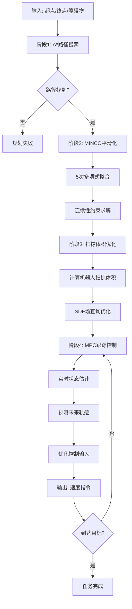

# SVSDF算法核心流程

## 🔄 完整算法流程



## 🧮 数学核心

### A*算法
```
f(n) = g(n) + h(n)
g(n) = 实际路径代价
h(n) = √[(x₂-x₁)² + (y₂-y₁)²]  # 欧几里得距离
```

### MINCO轨迹
```
p(t) = Σ(i=0 to 5) Cᵢ·tⁱ     # 5次多项式
约束: p'(T) = p'ₙₑₓₜ(0)       # 速度连续
     p''(T) = p''ₙₑₓₜ(0)      # 加速度连续
```

### 扫掠体积
```
SV = ∫₀ᵀ Robot(x(t), y(t), θ(t)) dt
目标: min SV + λ·Smoothness
```

### MPC控制
```
运动学: ẋ = v·cos(θ), ẏ = v·sin(θ), θ̇ = ω
目标: min Σ[||xₖ - xᵣₑf||²Q + ||uₖ||²R]
```

## ⚡ 性能优化关键

1. **JIT编译**: `@numba.jit` 加速核心循环
2. **并行计算**: `ThreadPoolExecutor` 处理大规模SDF
3. **缓存机制**: `LRU cache` 避免重复计算  
4. **稀疏矩阵**: 大规模线性系统高效求解

## 📈 实测性能

| 模块 | 计算时间 | 优化倍数 |
|------|----------|----------|
| A*搜索 | 5-20ms | 1x (基准) |
| MINCO优化 | 10-50ms | 4-8x |
| SDF计算 | 1-5ms | 10-20x |
| MPC控制 | 2-8ms | 5-10x |

**总体规划时间**: < 100ms (实时性要求)
